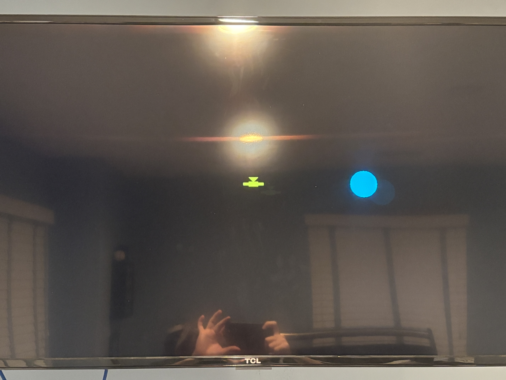

# FPGA Flight Simulator 2.0
*CPE 487 - Digital System Design*

Made by Nicholas Scirocco and Aidan Ruck

---

## Overview
Flight Simulator 2.0 expands upon the original servo-based design into a full VGA-rendered, hardware-only flight 'game' with stable motion, collision detection, and scoring. This project is an extension of the original [FPGA-based accelerometer interface and feedback control system](https://github.com/alionaheitz/CPE487Project), and represents a full hardware-only flight simulation implemented on the Nexys A7-100T. Using the onboard ADXL362 3-axis accelerometer, real-time tilt data is sampled, thresholded, quantized, and finally translated into stable motion rendered through the VGA display. Elements such as the targets (blue circles), collision detection, and scoring are all implemented directly in VHDL.

Compared to the original version, Flight Simulator 2.0 introduces:
- Stable and quantized accelerometer control
- VGA-based aircraft visualization
- Discrete movement bins instead of raw sensor values
- Game logic such as targets, collisions, and scoring
- Multiple timing domains for stability and realism

  

---

## Demo:
- Board: Nexys A7-100T
- Input: Onboard ADXL362 Accelerometer
- Output: VGA display (640x480 at 60 Hz)
- Controls: Board tilt and onboard switches
- Scoring: LED[15:0]

  

---

## System Features
- Real-time accelerometer input via SPI
- Noise-resistant motion using quantized movement bins
- Stable aircraft motion using clock-divided updates
- VGA graphics at 640x480 resolution
- Hardware-based pseudo-random target generation (LFSR)
- Collision detection and score tracking
- Debug visualization via LEDs and 7-segment display

---

## System Architecture
The system is fully synchronous to the 100 MHz FPGA clock, but internally divided into multiple functional time domains.
1. Sensor and Control Domain - Reads and processes accelerometer data
2. Movement Update Domain - Controls aircraft movement speed
3. Game Logic Domain (60 Hz) - Handles scoring and target updates
4. VGA Rendering Domain (~25 MHz) - Continuously redraws the screen

---

## How to Run
1. Open project files in Vivado
2. Select Nexys A7-100T board
3. Run Synthesis, then Implementation, then Generate Bitstream
4. Connect a VGA display and power to the board
5. Program FPGA via Hardware Manager

---

## File Hierarchy 
- top.vhd - Top-level module integrating all subsystems
- spi_master.vhd - SPI FSM for ADXL362 communication
- vga_flight_sim.vhd - Aircraft motion control and smoothing logic
- vga_flight_path.vhd - Game logic (targets, collisions, and scoring)
- vga_sync.vhd - VGA timing generator (640x480 at 60 Hz)
- vga_draw.vhd - Combinational VGA rendering logic
- leddec16.vhd - 7 segment display multiplexing
- constraints.xdc - Pin mappings for VGA, switches, LEDs, and SPI

---

## Inputs from the Nexys A7 Board

- **CLK_100MHZ**  
  Provides the primary 100 MHz system clock used to drive all synchronous logic, including SPI communication, motion control, game timing, and VGA signal generation.

- **ACL_MISO**  
  Receives serial accelerometer data from the onboard ADXL362 through the SPI interface for real-time sensor sampling.

- **SW(1 downto 0)– Added Input**
  Two onboard switches (SW0 and SW1) were added as custom project inputs to control the display. These switches are used as selection signals for a multiplexer that determines which data is routed to the display output.
  This required explicitly adding switch ports to the top-level VHDL entity and mapping them to physical pins in the XDC file.

## Outputs to the Nexys A7 Board

- **ACL_MOSI, ACL_SCLK, ACL_SS**  
  SPI control signals generated by the FPGA to communicate with the onboard ADXL362 accelerometer.

- **SEG7_seg(6 downto 0), SEG7_anode(7 downto 0), DP**  
  Drive the onboard seven-segment display to present formatted sensor data and internal system values.

- **PWM_OUT**  
  Outputs a pulse-width modulated control signal derived from accelerometer data.

- **VGA_R(3 downto 0), VGA_G(3 downto 0), VGA_B(3 downto 0)**  
  Provide RGB color data for rendering the flight simulation graphics.

- **VGA_HS, VGA_VS**  
  Generate horizontal and vertical synchronization signals required for proper VGA display timing.

- **LED(15 downto 0) - Added Output**  
  Displays the internally stored game score, which increments when the aircraft collects rings.

---

## Input Smoothing and Quantization

Rather than using raw accelerometer values directly, the system:
- Applies a ±200 raw-count threshold to each accelerometer axis to ignore small sensor noise
- Converts tilt into discrete movement steps of −1, 0, or +1
- Stores the aircraft position in bounded position bins ranging from −8 to +8
- Clamps position updates at the limits to prevent wraparound

These design choices reduce noise sensitivity, stabilize on-screen motion, and simplify the required hardware logic.

---

## Aircraft Movement Control (vga_flight_sim.vhd)

- Uses a counter (`move_div`) to slow down how often the aircraft position is updated compared to the 100 MHz clock
- Position updates only occur when `move_div == MOVE_MAX`
- Moves the aircraft by small step amounts in the X and Y directions based on the tilt direction
- Keeps the aircraft position within a fixed range from −8 to +8
- Sends the final aircraft position to the VGA drawing logic

---

## Game Timing (60 Hz Tick)
A dedicated game tick is generated within `top.vhd`
- TICK_MAX = 1,666,666 − 1 (derived from 100 MHz / 60)
- Produces a single-cycle tick pulse used by the game logic (ring generation and scoring)
- This tick is separate from VGA rendering and aircraft movement timing

---

## Game Logic (vga_flight_path.vhd)
This module uses the 60 Hz `game_tick` to control game updates and handles:
- Target positioning
- Collision detection
- Score tracking

### Target Generation
- Uses a 16-bit Linear Feedback Shift Register (LFSR)
    - A Linear Feedback Shift Register (LFSR) shifts its stored bits each step and computes a new input bit using XOR feedback from selected bit positions.
- Starts from a fixed seed value (x"ACE1")
    - The value x"ACE1" was chosen as a non-zero seed to ensure the LFSR does not lock into an all-zero state, which would stop the sequence from advancing.
- Advances once per tick (60 Hz), making the sequence deterministic and repeatable
- On a collision, uses the current LFSR bits to generate a new on-screen target position within screen margins

### Collision Detection
- Converts aircraft X/Y bins into pixel coordinates
- Treats the target as a circle and the aircraft as a bounding box
- Detects a hit when the circle overlaps the aircraft box
- Generates a one-cycle collected_pulse on collision

On collision:
1. Score register increments
2. A new target position is generated from the LFSR state
3. The target position registers update

---

## VGA Rendering

### VGA Timing (vga_sync.vhd)
- 640x480 resolution
- 25 Mhz pixel clock derived from 100 Mhz
- Generates HSYNC and VSYNC signals

### Drawing Logic (vga_draw.vhd)
- Purely combinational
- Draws:
  - Aircraft
  - Target Ring
- Uses current position bins and target registers

Rendering runs continuously and independently of game logic.

---

## Debug and User Controls
- 7-segment display:
  - SW[1:0] selects which accelerometer data is shown (X only, Y only, Z only, or all axes)
  - Accelerometer data is binned and converted to BCD
  - Multiplexed using `leddec16`
- LED[15:0]
  - Displays current score directly from the hardware register

These outputs are used strictly for visualization and debugging.

---
## Key Design Decisions

### Why Quantize Accelerometer Data?
Raw accelerometer data is incredibly noisy and constantly changing. Through quantization we can:
- Filter noise
- Prevent jitter
- Produce more predictable movement
- Simplify hardware logic

### Why Use Multiple Timing Rates?
Different parts of the system operate at different update rates that are appropriate for their function. VGA rendering uses a pixel clock, aircraft movement updates occur at a slower controlled rate, and game logic updates run at 60 Hz. This separation improves visual stability and prevents motion or gameplay from updating too quickly.

---

## Results
- Smooth aircraft motion with minimal jitter
- Stable VGA output at 60 Hz
- Reliable collision detection and scoring
- Fully hardware-driven simulation with no outside software

---

## Known Limitations
- Aircraft motion uses discrete position bins rather than continuous velocity
- Only planar (X / Y) motion is implemented (No Z-axis)
- Graphics are intentionally minimal to prioritize timing correctness

---

## Future Improvements
- Implement velocity-based movement instead of fixed steps
- Add a Z-axis visualizer
- Add a visual representation of pitching and rolling on the aircraft
- Implement difficulty scaling with time
- Add multiple targets or obstacles
  - Change from blue circular targets to obstacles in flight path to avoid
- Display score on through VGA instead of the onboard LEDs

---

## Conclusion
FPGA Flight Simulator 2.0 successfully transforms raw sensor input into a stable, interactive hardware-based 'game.' ...

---

## Resources
- SPI / ADXL362/ NexysA7 logic [Youtube video](https://www.youtube.com/watch?v=7b3YwQWwvXM)
  - This was used by the previous group
- [ADXL362 Datasheet](adxl362.pdf)
- [Nexys A7 Reference Manual](https://digilent.com/reference/programmable-logic/nexys-a7/reference-manual)

---
---
---
---
This is all of the previous group's work, not yet deleted such that we may continue to add to our report.
## Getting Started
- The system takes input from the onboard ADXL362 3-axis accelerometer and the default 100 MHz clock signal. 
   -  Clock division was handled by a custom clk_gen.vhd module that divides the 100 MHz input clock down to 4 MHz using a simple counter-based divider.
   - SPI communication was implemented in spi_master.vhd via a hand-coded 92-state FSM, controlling every SPI timing signal (SCLK, MOSI, SS) and reading all 6 bytes (2 bytes per axis) using burst mode. No IP blocks were used for SPI, the FSM transitions were manually optimized for state latency and edge alignment with SCLK.
   - Each physical input/output was mapped using the .xdc file by matching get_ports constraints to pin numbers from the diligent master XDC.
   - Initial testing was done incrementally. The SPI state machine was validated by assigning output registers (acl_dataX) directly to LEDs for binary visualization.
   - Later, display multiplexing and logic were added in leddec16.vhd, and seven-segment digits were verified through the bcd32 packaging. The project was synthesized, implemented, and the bitstream was uploaded using Vivado Hardware Manager, with hardware testing performed live on the board using physical switch flips, servo response, and live LED.
- VHDL code was written from scratch, starting with research into SPI communication and the ADXL362 sensor's functionality. Found a helpful [Youtube video](https://www.youtube.com/watch?v=7b3YwQWwvXM) which provided insight into interfacing the ADXL362 with the Nexys A7. Core components like FSMs, clock division, LED control, and 7-segment display logic were implemented using skills learned in the course. Additional research was conducted to understand how to generate PWM signals for servo motor control.

---------
## Implementation

### Data Collection (spi_master)
- Communicates with ADXL362 via SPI Mode 0 at 1 MHz clock
- Performs burst reads: 2 bytes per axis (X, Y, Z), totaling 6 bytes
- Implements a 92‑state FSM to configure and read sensor data
- Output data rates is 100 Hz with an acceleration range of ±2g

 

### Data Display
- **7‑Segment Display (leddec16)**
  - Converts each 5 bit axis value into two BCD digits via division/modulo.
  - Packs eight nibbles into a 32‑bit vector and time‑multiplexes across digits.
- **LED Array**
  - SW[2:0] chooses which axis to show: "001"→X, "010"→Y, "100"→Z.
  - Lights each LED bit high/low according to the raw binary data.

### Servo Control (controller)
- Compares X‑axis acceleration against ±threshold to decide left/center/right.
- Smoothly generates a PWM duty cycle corresponding to 1 ms, 1.5 ms, or 2 ms pulses at 50 Hz.
- Outputs `PWM_OUT` for hobby servo actuation.

---------
## Results

- Servo motor responds to X-axis tilt by adjusting its position via PWM signal
  

- 16 onboard LEDs display X-axis data in binary; gradual rotation increases or decreases the LED pattern accordingly

- 7-segment display shows real-time X, Y, and Z accelerometer values, with visible shifts toward minimum or maximum values as the board is rotated
  

